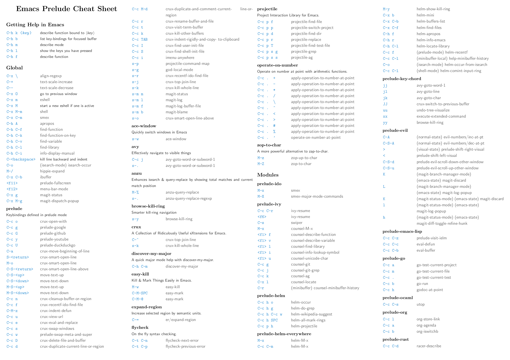

# Usage

## Running

Nothing fancy here. Just start Emacs as usual. Personally I run Emacs
in daemon mode:

```bash
emacs --daemon
```

Afterwards I connect to the server with either a terminal or a GUI
client like this:

```bash
emacsclient -t
emacsclient -c
```

You'd probably do well to put a few aliases in your `.zshrc` (or
`.bashrc`):

```bash
alias e='emacsclient -t'
alias ec='emacsclient -c'
alias vim='emacsclient -t'
alias vi='emacsclient -t'
```

The last two aliases are helpful if you're used to editing files from
the command line using `vi(m)`.

You can also open a file with the cursor positioned directly on a specific line:

```bash
emacsclient somefile:1234
```

This will open file `somefile` and set cursor on line 1234.

## Getting to know Prelude

Certainly the best way to understand how Prelude enhances the default
Emacs experience is to peruse Prelude's source code (which is
obviously written in Emacs Lisp). Understanding the code is not
necessary of course. Prelude includes a `prelude-mode` minor Emacs mode
which collects some of the additional functionality added by
Prelude. It also adds an additional keymap that binds many of those
extensions to keybindings.

### Keymap

#### Global

Keybinding         | Description
-------------------|------------------------------------------------------------
<kbd>C-x \\</kbd>   | `align-regexp`
<kbd>C-+</kbd>     | Increase font size(`text-scale-increase`).
<kbd>C--</kbd>     | Decrease font size(`text-scale-decrease`).
<kbd>C-x O</kbd>   | Go back to previous window (the inverse of `other-window` (`C-x o`)).
<kbd>C-^</kbd>     | Join two lines into one(`crux-top-join-line`).
<kbd>C-x p</kbd>   | Start `proced` (manage processes from Emacs; works only in Linux).
<kbd>C-x m</kbd>   | Start `eshell`.
<kbd>C-x M-m</kbd> | Start your default shell.
<kbd>C-x C-m</kbd> | Alias for `M-x`.
<kbd>M-X</kbd>     | Like `M-x` but limited to commands that are relevant to the active major mode.
<kbd>C-h A</kbd>   | Run `apropos` (search in all Emacs symbols).
<kbd>C-h C-m</kbd> | Display key bindings of current major mode and descriptions of every binding.
<kbd>M-/</kbd>     | Run `hippie-expand` (a replacement for the default `dabbrev-expand`).
<kbd>C-x C-b</kbd> | Open `ibuffer` (a replacement for the default `buffer-list`).
<kbd>F11</kbd>     | Make the window full screen.
<kbd>F12</kbd>     | Toggle the Emacs menu bar.
<kbd>C-x g</kbd>   | Open Magit's status buffer.
<kbd>C-x M-g</kbd> | Open Magit's popup of popups.
<kbd>M-Z</kbd>     | Zap up to char.
<kbd>C-=</kbd>     | Run `expand-region` (incremental text selection).
<kbd>C-a</kbd>     | Run `crux-move-beginning-of-line`. Read [this](http://emacsredux.com/blog/2013/05/22/smarter-navigation-to-the-beginning-of-a-line/) for details.

#### Prelude Mode

Keybinding         | Description
-------------------|------------------------------------------------------------
<kbd>C-c o</kbd>   | Open the currently visited file with an external program.
<kbd>C-c i</kbd>   | Search for a symbol, only for buffers that contain code
<kbd>C-c g</kbd>   | Search in Google for the thing under point (or an interactive query).
<kbd>C-c G</kbd>   | Search in GitHub for the thing under point (or an interactive query).
<kbd>C-c y</kbd>   | Search in YouTube for the thing under point (or an interactive query).
<kbd>C-c U</kbd>   | Search in Duckduckgo for the thing under point (or an interactive query).
<kbd>C-S-RET</kbd> or <kbd>Super-o</kbd> | Insert an empty line above the current line and indent it properly.
<kbd>S-RET</kbd> or <kbd>M-o</kbd> | Insert an empty line and indent it properly (as in most IDEs).
<kbd>C-S-up</kbd> or <kbd>M-S-up</kbd> | Move the current line or region up.
<kbd>C-S-down</kbd> or <kbd>M-S-down</kbd>| Move the current line or region down.
<kbd>C-c n</kbd> | Fix indentation in buffer and strip whitespace.
<kbd>C-c f</kbd> | Open recently visited file.
<kbd>C-M-\\</kbd> | Indent region (if selected) or the entire buffer.
<kbd>C-c u</kbd> | Open a new buffer containing the contents of URL.
<kbd>C-c e</kbd> | Eval a bit of Emacs Lisp code and replace it with its result.
<kbd>C-c s</kbd> | Swap two active windows.
<kbd>C-c D</kbd> | Delete current file and buffer.
<kbd>C-c d</kbd> | Duplicate the current line (or region).
<kbd>C-c M-d</kbd> | Duplicate and comment the current line (or region).
<kbd>C-c r</kbd> | Rename the current buffer and its visiting file if any.
<kbd>C-c t</kbd> | Open a terminal emulator (`ansi-term`).
<kbd>C-c k</kbd> | Kill all open buffers except the one you're currently in.
<kbd>C-c TAB</kbd> | Indent and copy region to clipboard
<kbd>C-c I</kbd> | Open user's init file.
<kbd>C-c S</kbd> | Open shell's init file.
<kbd>C-c . +</kbd> | Increment integer at point. Default is +1.
<kbd>C-c . -</kbd> | Decrement integer at point. Default is -1.
<kbd>C-c . *</kbd> | Multiply integer at point. Default is *2.
<kbd>C-c . /</kbd> | Divide integer at point. Default is /2.
<kbd>C-c . \\</kbd> | Modulo integer at point. Default is modulo 2.
<kbd>C-c . ^</kbd> | Power to the integer at point. Default is ^2.
<kbd>C-c . <</kbd> | Left-shift integer at point. Default is 1 position to the left.
<kbd>C-c . ></kbd> | Right-shift integer at point. Default is 1 position to the right.
<kbd>C-c . #</kbd> | Convert integer at point to specified base. Default is 10.
<kbd>C-c . %</kbd> | Replace integer at point with another specified integer.
<kbd>C-c . '</kbd> | Perform arithmetic operations on integer at point. User specifies the operator.
<kbd>Super-r</kbd> | Recent files
<kbd>Super-j</kbd> | Join lines
<kbd>Super-k</kbd> | Kill whole line
<kbd>Super-m m</kbd> | Magit status
<kbd>Super-m l</kbd> | Magit log
<kbd>Super-m f</kbd> | Magit file log
<kbd>Super-m b</kbd> | Magit blame mode

!!! Note

    For various arithmetic operations, the prefix `C-c .` only needs to be pressed once for the first operation.
    For subsequent operations, only the appropriate operations (i.e. `+`, `-`, `*`, `/`... needs to be pressed).

#### macOS modifier keys

Prelude does not mess by default with the standard mapping of `Command` (to `Super`) and `Option` (to `Meta`).

If you want to swap them add this to your personal config:

```lisp
(setq mac-command-modifier 'meta)
(setq mac-option-modifier 'super)
```

You can also temporarily swap them with `C-c w` (`M-x prelude-swap-meta-and-super`).

!!! Tip

    [The Emacs Mac port](https://bitbucket.org/mituharu/emacs-mac.git) comes
    with `Command`
    [set](https://bitbucket.org/mituharu/emacs-mac/src/7fdbfba85d543f01b81e997e2b03788c35cb3bfa/src/macterm.c?at=master&fileviewer=file-view-default#macterm.c-6147:6169)
    to `Meta`.

!!! Tip

    I'd highly recommend to all macOS users to consider
    [remapping Return to Control](http://emacsredux.com/blog/2013/11/12/a-crazy-productivity-boost-remap-return-to-control/)
    instead. That's an epic productivity boost and it's not as crazy as it sounds!

#### Projectile

[Projectile](https://github.com/bbatsov/projectile) is one of the essential packages bundled with Prelude.
It provides an easy way to navigate and switch projects. Take a look at its extensive documentation
to get a feel for everything you can do with Projectile.

Prelude adds an extra keymap prefix `s-p` (`s` stands for
`Super`) in addition to the standard one `C-c p`. By default on Windows keyboard
`Super` is mapped to the `Windows` key and on macOS keyboards `Super` is mapped
to the `Command` key.

If you ever forget any of Projectile's keybindings just do a:

<kbd>C-c p C-h</kbd> or <kbd>s-p C-h</kbd>

Alternatively you can just press <kbd>s-p</kbd> and wait for a moment
for `which-key` to kick in and show you the available keybindings.

#### Helm

Helm is setup according to this guide: [A Package in a league of its own: Helm](http://tuhdo.github.io/helm-intro.html).

You can learn Helm usage and key bindings following the guide. <kbd>C-c h</kbd> is Prelude's default prefix key for Helm.
If you don't remember any key binding, append <kbd>C-h</kbd> after <kbd>C-c h</kbd> for a list of key bindings in Helm.

If you love Helm and want to use Helm globally with enhanced `helm-find-files`, `helm-buffer-lists`..., you will have to also add `(require 'prelude-helm-everywhere)`.
When `prelude-helm-everywhere` is activated, Helm enables these global key bindings:

Key binding        | Description
-------------------|----------------------------------------------
<kbd>M-x</kbd>     | Run [helm-M-x](http://tuhdo.github.io/helm-intro.html#sec-3), an interactive version of <kbd>M-x</kdb>.
<kbd>M-y</kbd>     | Run [helm-show-kill-ring](http://tuhdo.github.io/helm-intro.html#sec-4), shows the content of `kill-ring`.
<kbd>C-x b </kbd>  | Run [helm-mini](http://tuhdo.github.io/helm-intro.html#sec-5), an interactive version of `C-x b` with more features.
<kbd>C-x C-f</kbd> | Run [helm-find-files](http://tuhdo.github.io/helm-intro.html#sec-6), an interactive version of `find-file` with more features.
<kbd>C-h f </kbd>  | Run [helm-apropos](http://tuhdo.github.io/helm-intro.html#sec-13), an interactive version of `apropos-command`.
<kbd>C-h r</kbd>   | Run [helm-info-emacs](http://tuhdo.github.io/helm-intro.html#sec-14), an interactive version of `info-emacs-manual`.
<kbd>C-h C-l </kbd>| Run `helm-locate-library` that can search for locations of any file loaded into Emacs.

This key binding is activated in `shell-mode`:

Key Binding        | Description
-------------------|----------------------------------------------
<kbd>C-c C-l</kbd>     | Run `helm-comint-input-ring` that shows `shell` history using Helm interface.

This key bindings is activated in `eshell-mode`:

Key Binding        | Description
-------------------|----------------------------------------------
<kbd>C-c C-l</kbd>     | Run `helm-eshell-history` that shows `eshell` history using Helm interface.

If you prefer Ido in everywhere, you should not add `prelude-helm-everywhere`, so you can use Helm along with Ido and Prelude's default commands.

You can always reactivate Helm with `(prelude-global-helm-global-mode-on)`.

!!! Note

    In `helm-M-x`, you have to pass prefix argument *AFTER* you run `helm-M-x`,
    because your prefix argument will be displayed in the modeline when in `helm-M-x`
    buffer. Passing prefix argument **BEFORE** =helm-M-x= **has no effect**.


#### Key-chords

!!! Note

    Key-chords are available only when the `prelude-key-chord` module has been enabled.

Keybinding         | Description
-------------------|----------------------------------------------
<kbd>jj</kbd>      | Jump to the beginning of a word(`avy-goto-word-1`)
<kbd>jk</kbd>      | Jump to a character(`avy-goto-char`)
<kbd>jl</kbd>      | Jump to the beginning of a line(`avy-goto-line`)
<kbd>JJ</kbd>      | Jump back to previous buffer(`crux-switch-to-previous-buffer`)
<kbd>uu</kbd>      | View edits as a tree(`undo-tree-visualize`)
<kbd>xx</kbd>      | Executed extended command(`execute-extended-command`)
<kbd>yy</kbd>      | Browse the kill ring(`browse-kill-ring`)

##### Disabling key-chords

In some cases you may not want to have a key-chord that is defined by prelude,
in which case you can disable the binding in your `personal.el` file by setting
its command to `nil`. For example, to disable the `jj` key-chord add the
following line:

```lisp
(key-chord-define-global "jj" nil)
```

If you're an `evil-mode` user you'll probably do well to disable `key-chord-mode` altogether:

```lisp
(key-chord-mode -1)
```

#### vim emulation

If you want to use vim keybindings inside of Emacs enable the `prelude-evil` module which provides
support for `evil-mode`.

### Cheatsheet

Use `C-h k <key>` (`<key>` are the ones listed on the left) or `C-h f <function>` (`<function>` are the ones listed on the right) to see the detailed explanation.



#### PDF generation

Install [LaTeX](https://www.latex-project.org/get/)

``` bash
cd modules/doc
pdflatex prelude-cheatsheet.tex
```

#### PNG generation

Install [Poppler](https://poppler.freedesktop.org/)

``` bash
cd modules/doc
pdftocairo -png -singlefile prelude-cheatsheet.pdf cheatsheet
```

## Automatic package installation

The default Prelude installation comes with a bare minimum of
functionality. It will however install add-ons for various programming
languages and frameworks on demand. For instance - if you try to open
a `.clj` file `clojure-mode`, `cider` and Prelude's enhanced Lisp
configuration will be installed automatically for you.

You can, of course, install anything you wish manually as well.
